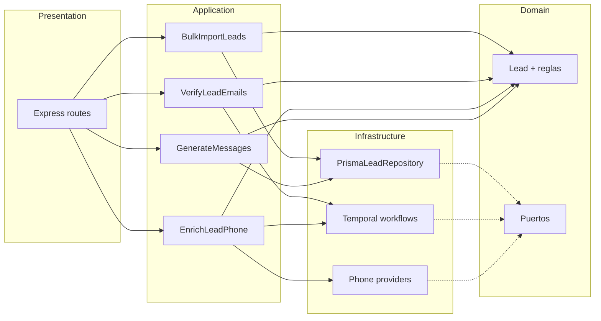

# TinyEnginy — Análisis del código y roadmap técnico

**Tipo de documento:** Backlog de mejoras de ingeniería  
**Alcance:** `backend/`, `frontend/`, workflows Temporal, importación CSV, enriquecimiento  
**Última revisión:** Mayo 2026

---

## 1. Resumen ejecutivo

TinyEnginy es una aplicación de gestión de leads a escala take-home: importar leads desde CSV, verificar emails con Temporal, generar mensajes con plantillas y (según el README) enriquecer números de teléfono con proveedores externos. El stack es un **monorepo pnpm** con **Express + Prisma (SQLite)** en el backend y **React 18 + Vite + TanStack Query** en el frontend.

El código funciona para demos pero está optimizado para velocidad de entrega, no para mantenibilidad a largo plazo. Las brechas de mayor impacto son la **estructura del backend** (un solo archivo de rutas de 324 líneas), **contratos de API inconsistentes** (p. ej. `name` vs `firstName`), **enriquecimiento síncrono de larga duración** en el camino HTTP y **falta de observabilidad** en los workflows de Temporal.

Este documento propone un roadmap por fases con trade-offs explícitos para que el equipo pueda entregar de forma incremental sin bloquear el trabajo de producto.

**Arquitectura recomendada:** monorepo **pnpm** (`apps/*` + `packages/*`) con **DDD-light** — casos de uso por flujo de producto, puertos para Prisma/Temporal/proveedores, migración incremental desde el layout actual.

---

## 2. Arquitectura actual (as-is)

```
┌─────────────────────────────────────────────────────────────────┐
│  Frontend (SPA, sin router)                                      │
│  LeadsList │ CsvImportModal │ MessageTemplateModal                │
│  TanStack Query + axios → http://localhost:4000                  │
└───────────────────────────────┬─────────────────────────────────┘
                                │ REST JSON
┌───────────────────────────────▼─────────────────────────────────┐
│  Backend (Express 5, puerto 4000)                                 │
│  src/index.ts — todas las rutas, CORS, bulk import, verify-emails│
│  Prisma → SQLite (dev.db)                                         │
│  Worker Temporal (mismo proceso) — taskQueue: myQueue             │
└───────────────────────────────┬─────────────────────────────────┘
                                │
                    ┌───────────▼───────────┐
                    │  Temporal (localhost)  │
                    │  verifyEmailWorkflow   │
                    └───────────────────────┘
```

| Capa | Tecnología | Notas |
|------|------------|--------|
| API | Express 5 | Sin versionado, sin auth, validación manual |
| BD | Prisma + SQLite | Un solo modelo `lead`; válido en local, no en producción |
| Async | Temporal 1.13 | Worker en el mismo proceso que el servidor API |
| Frontend | React 18, Vite 7, Tailwind 4 | Vista única; modales vía portals |
| CSV | PapaParse (cliente) | Parseo en el navegador; JSON a `/leads/bulk` |

### 2.1 Arquitectura objetivo (recomendada): monorepo pnpm + DDD-light

**Decisión:** Evolucionar el repo actual (`pnpm-workspace` con `frontend/` y `backend/`) hacia un **monorepo pnpm** con capas **DDD-light**. Es más escalable que un `index.ts` monolítico y encaja con el flujo de trabajo del producto (import → verificar → enriquecer → mensajear), sin la complejidad de DDD táctico completo.

#### Estado actual vs objetivo

| Aspecto | Hoy (`workspace-monorepo`) | Objetivo |
|---------|---------------------------|----------|
| Workspace | `frontend` + `backend` en raíz | `apps/*` + `packages/*` |
| Backend | Un archivo de rutas (~324 líneas) | Capas domain → application → infrastructure → presentation |
| Código compartido | Duplicado (p. ej. `countryCode`) | `packages/shared` |
| Temporal | Mezclado con Express | Workflows en infrastructure; casos de uso en application |
| Tests | Por util suelta | Por caso de uso + puertos (mocks de repositorio) |

#### Layout del monorepo (pnpm)

```text
tinyenginy/
├── pnpm-workspace.yaml
├── package.json                 # scripts: dev, test, build (-r)
├── apps/
│   ├── api/                     # Express: solo wiring HTTP (antes backend/)
│   │   └── src/
│   │       ├── main.ts
│   │       ├── composition/     # ensamblado DI (container)
│   │       └── presentation/    # controllers, routes, middleware
│   └── web/                     # React SPA (antes frontend/)
├── packages/
│   ├── shared/                  # tipos, ISO country, validaciones puras
│   ├── domain/                  # entidades, VOs, puertos (interfaces)
│   ├── application/             # casos de uso (orquestación)
│   └── infrastructure/          # Prisma, Temporal, clientes HTTP proveedores
└── docs/
```

**`pnpm-workspace.yaml`:**

```yaml
packages:
  - 'apps/*'
  - 'packages/*'
```

**Dependencias entre paquetes (regla de acoplamiento):**

```text
apps/api  →  application  →  domain
                ↓
         infrastructure  →  domain
apps/web  →  shared
packages/application  →  domain, shared
packages/infrastructure  →  domain, application (solo tipos de puertos), shared
```

`domain` no importa de `infrastructure` ni de `apps/*` (dependencias hacia dentro).

#### Capas DDD-light (responsabilidades)

| Capa | Contenido | Ejemplo TinyEnginy |
|------|-----------|-------------------|
| **Domain** | Entidad `Lead`, reglas (email requerido, país ISO alpha-2), puertos `LeadRepository`, `EmailVerifier`, `PhoneEnricher` | `Lead.normalizeCountryCode()` delega a shared; interfaz `ILeadRepository` |
| **Application** | Casos de uso sin HTTP ni Prisma | `BulkImportLeads`, `VerifyLeadEmails`, `EnrichLeadPhone`, `GenerateLeadMessages` |
| **Infrastructure** | Implementaciones de puertos | `PrismaLeadRepository`, actividades Temporal, adapters Orion/Astra/Nimbus |
| **Presentation** | Express routes → DTO → caso de uso → respuesta | `POST /leads/bulk` llama `BulkImportLeads.execute()` |
| **Composition** | Cableado en `main.ts` | Instanciar repos + use cases + montar router |

#### Flujo de trabajo alineado con el producto

Cada flujo del README se modela como **un caso de uso** con entrada/salida explícitas:



Esto **asegura el flujo requerido**: la UI solo habla con la API; la API solo orquesta casos de uso; Temporal y proveedores viven detrás de puertos (fácil de testear con mocks).

#### Trade-offs DDD-light vs alternativas

| Enfoque | Cuándo | Por qué no solo esto |
|---------|--------|---------------------|
| **Monolito `index.ts`** | Take-home mínimo | No escala con enrich + nuevos campos + más proveedores |
| **Routes + services** | Equipo pequeño, poco dominio | Mezcla orquestación y persistencia; Temporal sigue acoplado |
| **DDD-light** (recomendado) | Varios flujos async + integraciones externas | Un poco más de carpetas; ganancia en tests y PRs por capa |
| **DDD + eventos de dominio** | Multi-tenant, auditoría estricta | Overkill para TinyEnginy |

#### Migración incremental (sin big-bang)

1. **Paso 1** — Crear `packages/shared` (country ISO, tipos `LeadDTO`); enlazar desde `frontend` y `backend`.
2. **Paso 2** — Extraer `packages/domain` + `packages/application` con un caso de uso (`BulkImportLeads`).
3. **Paso 3** — `packages/infrastructure` + mover Prisma y Temporal.
4. **Paso 4** — Renombrar `backend` → `apps/api`, `frontend` → `apps/web`; actualizar README y scripts raíz.
5. **Paso 5** — Resto de casos de uso (verify, enrich, messages) y borrar lógica de `index.ts`.

Cada paso = **un PR trunk-based** (`gt`), alineado con el resto del take-home.

#### Scripts raíz (pnpm)

```json
{
  "scripts": {
    "dev": "pnpm run --parallel dev:api dev:web",
    "dev:api": "pnpm --filter @tinyenginy/api dev",
    "dev:web": "pnpm --filter @tinyenginy/web dev",
    "build": "pnpm -r build",
    "test": "pnpm -r test",
    "db:migrate": "pnpm --filter @tinyenginy/infrastructure migrate:dev"
  }
}
```

---

## 3. Hallazgos de las tareas del take-home

### 3.1 Bugs del README — estado por rama

| Problema | Rama | Estado |
|----------|------|--------|
| **Códigos de país corruptos en CSV** | `fix/csv-country-codes-iso-alpha2` | ✅ Implementado (normalización ISO 3166-1 alpha-2, BOM, alias `country`, `USA`→`US`) |
| **Verificación de email colgada** | `fix/email-verification-hang` | ✅ Implementado en rama dedicada (timeouts, workflow y feedback en UI) |

### 3.2 Features del README — estado por rama

| Feature | Rama | Estado |
|---------|------|--------|
| **Nuevos campos de lead** | — | ⬜ **Pendiente** — faltan `phoneNumber`, `yearsAtCompany`, `linkedin` en Prisma, API, parser CSV, tabla y variables de mensaje |
| **Enrich phone** | `feature/enrich-phone` | ✅ Implementado en rama dedicada (workflow Temporal, proveedores, API y UI) |
| **Revisión de PR** | `feature/implement-gender-guessing` | ✅ Cubierto en rama del compañero (revisión del PR de gender guessing / enrichment) |

### 3.3 Code smells estructurales (no son bugs, pero cuestan)

1. **`backend/src/index.ts` monolítico** — CRUD, importación masiva, generación de mensajes y verificación de email en un archivo; difícil testear rutas aisladas.
2. **Dos patrones de mutación en frontend** — Existe `useApiMutation` (tipado, optimista) pero `LeadsList` usa `useMutation` inline; la ruta optimista de `leads.create` no se usa.
3. **Inconsistencia de API** — `POST /leads` espera `name` pero bulk import usa `firstName`; `PATCH` solo actualiza `name`/`email`.
4. **Worker Temporal en el proceso API** — Simplifica dev local; impide escalar y desplegar por separado.
5. **Sin paquete compartido de tipos** — Forma de `Lead` duplicada entre tipos del API en frontend y modelo Prisma.
6. **SQLite en el repo** — `dev.db` puede divergir entre máquinas; no hay script seed para demos reproducibles.
7. **Dependencias sin usar** — `@tabler/icons-react` instalado; los componentes usan SVGs inline.
8. **Tabla de leads a escala** — Sin paginación, búsqueda ni virtual scroll; refetch de lista completa en cada invalidación.

---

## 4. Trade-offs y decisiones recomendadas

### 4.1 ¿Dónde validar los datos del CSV?

| Opción | Pros | Contras | Recomendación |
|--------|------|---------|---------------|
| **Solo cliente** (actual) | Feedback rápido en la vista previa | Clientes alternativos pueden saltarse reglas | Mantener para UX de preview |
| **Solo servidor** | Única fuente de verdad | Feedback más lento | Añadir para producción |
| **Ambos (reglas compartidas)** | UX + seguridad consistentes | Requiere módulo compartido o tests duplicados | **Preferido** — extraer normalización de `countryCode` (y campos futuros) a util compartido o duplicar con tests espejo |

**Decisión:** Normalizar códigos de país en **parseo frontend e import bulk backend** (ya iniciado). Añadir tests de integración en `POST /leads/bulk`.

---

### 4.2 Códigos de país: ISO estricto vs mapeo permisivo

| Opción | Pros | Contras | Recomendación |
|--------|------|---------|---------------|
| **Solo alpha-2 estricto** | Simple, predecible | Rechaza `USA`, error común del usuario | Demasiado estricto solo |
| **Alpha-2 + mapa alpha-3 pequeño** | Corrige `USA` → `US` sin dataset ICU completo | El mapa hay que mantenerlo | **Enfoque actual** — ampliar según tickets de soporte |
| **Librería ISO 3166 completa** | Completo | Tamaño de bundle, dependencia | Posponer hasta necesitar nombres de país (i18n) |

---

### 4.3 Verificación de email: execute síncrono vs workflow async

| Opción | Pros | Contras | Recomendación |
|--------|------|---------|---------------|
| **`workflow.execute` síncrono en el handler HTTP** (actual) | Código simple | La petición bloquea; un lead lento bloquea el lote; mala UX | Sustituir en producción |
| **Iniciar workflow + polling de estado** | API responsive; alinea con “feedback” del README | Más endpoints y estado en UI | **Preferido** |
| **Webhooks / SSE** | Actualizaciones en tiempo real | Complejidad de infra | Fase 3 |

---

### 4.4 Enrich phone: proveedores secuenciales en un workflow

| Opción | Pros | Contras | Recomendación |
|--------|------|---------|---------------|
| **Actividades secuenciales** (README) | Orden claro; retries por proveedor | Latencia = suma de proveedores | **Exigido por la spec** |
| **Carrera en paralelo** | Más rápido | Rompe prioridad “mejor dato primero” (Orion → Astra → Nimbus) | No usar |
| **Rate limiting** | Preparado para límites de proveedores | Redis o rate limiter de Temporal | Nice-to-have: token bucket por proveedor en la actividad |

**Idempotencia:** Usar workflow ID `enrich-phone-{leadId}` y `WorkflowIdReusePolicy` reject duplicate para cumplir “solo uno por lead”.

---

### 4.5 Refactor del backend: monorepo + DDD-light

| Opción | Esfuerzo | Beneficio |
|--------|----------|-----------|
| **Mantener monolito** | Ninguno | Rápido para take-home; techo bajo |
| **Routes + services** | Medio | Mejor que hoy; Temporal sigue acoplado al HTTP |
| **Monorepo pnpm + DDD-light** | Medio-alto | Escala con enrich/campos; flujos = casos de uso; tests por puerto | **Recomendado** |
| **DDD + event sourcing** | Alto | Excesivo para TinyEnginy |

**Recomendación:** Seguir la migración de la [sección 2.1](#21-arquitectura-objetivo-recomendada-monorepo-pnpm--ddd-light): `packages/domain` + `application` + `infrastructure`, `apps/api` como capa fina HTTP. No hace falta agregados ni value objects para cada campo; entidad `Lead` + puertos bastan.

---

### 4.6 Base de datos: SQLite vs Postgres

| Contexto | Elección |
|----------|----------|
| Take-home local | SQLite está bien |
| Staging / producción | Postgres (cambio en Prisma con poco esfuerzo) |

**Trade-off:** SQLite simplifica el setup; escrituras concurrentes y cargas pesadas de Temporal se benefician de Postgres.

---

### 4.7 UX de composición de mensajes (lista de campos creciente)

| Opción | Pros | Contras | Recomendación |
|--------|------|---------|---------------|
| **Fila de botones pill** (actual) | Obvio | Rompe el layout con 10+ campos | OK para ≤8 campos |
| **Combobox con búsqueda** | Escala | Un poco más de UI | **Al añadir phone/years/linkedin** |
| **Autocomplete en textarea** | Para power users | Más difícil de implementar | Fase 2 |

Impulsar campos disponibles desde **metadatos del servidor** (`GET /leads/template-fields`) para no hardcodear en frontend.

---

## 5. Estrategia de testing (brechas y mejoras)

| Área | Actual | Objetivo |
|------|--------|----------|
| CSV / códigos de país | Tests unitarios (Given/When/Then) en parser + normalizador | Fixtures con `docs/leads-*.csv` |
| Generador de mensajes | Buena cobertura unitaria | Mantener |
| Rutas HTTP | Ninguna | Supertest en bulk import + verify-emails |
| Temporal | Ninguno en CI | Workflows con `@temporalio/testing` |
| E2E | Ninguno | Playwright: importar CSV → ver columna país |

**Trade-off:** Los tests de Temporal alargan el CI pero evitan regresiones en timeout/retry (clase del bug de verificación de email).

---

## 6. Seguridad y preparación para producción (fuera del take-home, obligatorio para ship real)

- Sin autenticación ni aislamiento por tenant
- CORS `*` en todos los orígenes
- API keys de proveedores deben ir en variables de entorno (`ORION_AUTH`, etc.) — nunca commitear secretos
- Sin rate limiting en importación masiva
- Sin audit log de enriquecimiento o verificación

Aceptable para el ejercicio; documentar como **blockers antes de producción**.

---

## 7. Roadmap técnico

Prioridades: **P0** (urgente/corrección), **P1** (entregables README), **P2** (calidad), **P3** (escala).

### Fase 0 — Corrección (P0) — completada en ramas

| Ítem | Rama | Estado |
|------|------|--------|
| CSV país ISO alpha-2 | `fix/csv-country-codes-iso-alpha2` | ✅ |
| Verificación de email | `fix/email-verification-hang` | ✅ |
| Test integración bulk import (opcional) | Puede ir en la rama CSV o en `main` tras merge | ⬜ Nice-to-have |

---

### Fase 1 — Features del README (P1)

| Ítem | Rama | Estado |
|------|------|--------|
| **Nuevos campos de lead** | Por crear (`feat/lead-fields-*`) | ⬜ **Único pendiente de implementación** |
| Enrich phone (workflow + API + UI) | `feature/enrich-phone` | ✅ |
| Revisión de PR (gender guessing) | `feature/implement-gender-guessing` | ✅ |

**Criterios de salida restantes:** Migración Prisma + API + CSV + tabla + composición de mensajes para `phoneNumber`, `yearsAtCompany` y `linkedin`; PR trunk-based con tests Given/When/Then.

---

### Fase 2 — Monorepo pnpm + DDD-light (P2) — ~1–2 semanas

| Paso | Ítem | Beneficio |
|------|------|-----------|
| 1 | `packages/shared` (ISO país, tipos Lead compartidos) | DRY frontend/backend |
| 2 | `packages/domain` + `packages/application` (primer UC: `BulkImportLeads`) | Patrón para el resto de flujos |
| 3 | `packages/infrastructure` (Prisma, Temporal, proveedores) | Puertos testeables |
| 4 | `apps/api` + `apps/web` (mover desde `backend/` / `frontend/`) | Layout monorepo estándar |
| 5 | Casos de uso: verify, enrich, messages | Paridad con README sin monolito |
| 6 | Unificar API (`firstName` en todos los endpoints) | Menos bugs de cliente |
| 7 | `prisma/seed.ts` + `pnpm db:seed` | Demos reproducibles |

---

### Fase 3 — Producto y escala (P3) — continuo

| Ítem | Beneficio |
|------|-----------|
| Postgres + `DATABASE_URL` por entorno | Camino a producción |
| Proceso/contenedor worker Temporal separado | Escalado independiente |
| Paginación + búsqueda en leads | UX con 1k+ filas |
| Rate limiting de proveedores (token bucket) | Nice-to-have del README |
| SSE o polling para enrich largos | Mejor percepción de rendimiento |
| Auth (aunque sea API key por workspace) | Seguridad multi-tenant |

---

## 8. Stack de PRs (trunk-based) — estado actual

Ramas ya trabajadas (independientes, listas para merge a `main`):

```
main
 ├── fix/csv-country-codes-iso-alpha2      ✅ P0 — CSV / ISO alpha-2
 ├── fix/email-verification-hang           ✅ P0 — verificación email
 ├── feature/enrich-phone                  ✅ P1 — enrich phone
 └── feature/implement-gender-guessing     ✅ P1 — revisión PR compañero
```

**Pendiente de crear:**

```
main
 └── feat/lead-fields                      ⬜ P1 — phoneNumber, yearsAtCompany, linkedin
     (opcional: feat/lead-fields-backend + feat/lead-fields-frontend si se quiere dividir)
```

Cada PR incluye tests **Given/When/Then** de su alcance. El único feature del README sin rama propia es **nuevos campos de lead**.

---

## 9. Métricas a seguir tras las mejoras

| Métrica | Por qué |
|---------|---------|
| Tasa de éxito import CSV | Valida parser + normalización |
| Latencia p95 verificación email | Detecta regresiones de timeout |
| Tasa éxito enrich phone / “sin datos” | Salud de proveedores |
| Tasa de inicio duplicado de workflow | Efectividad de idempotencia |

---

## 10. Resumen

TinyEnginy muestra patrones full-stack sólidos para un alcance acotado (cliente API tipado, React Query, integración Temporal, preview de CSV). La deuda técnica principal es la **concentración de lógica en pocos archivos grandes** y el **tratamiento síncrono de workflows async**, no la elección de framework.

**Arquitectura recomendada a medio plazo:** **monorepo pnpm** (`apps/*` + `packages/*`) con **DDD-light** — cada flujo del producto como caso de uso, integraciones detrás de puertos, fácil de escalar cuando crezcan campos de lead y proveedores de enrich (ver [§2.1](#21-arquitectura-objetivo-recomendada-monorepo-pnpm--ddd-light)).

**Próximos pasos recomendados:**

1. **Implementar nuevos campos de lead** (`feat/lead-fields`) — único ítem funcional pendiente del README.  
2. Hacer merge de las ramas existentes a `main` en orden trunk-based (`gt submit` / PRs independientes).  
3. **Fase 2:** migración incremental a monorepo + DDD-light (empezar por `packages/shared` y `BulkImportLeads`).

El take-home queda cerrado en funcionalidad salvo **phoneNumber**, **yearsAtCompany** y **linkedin**; el resto vive en ramas dedicadas listas para integrar.
